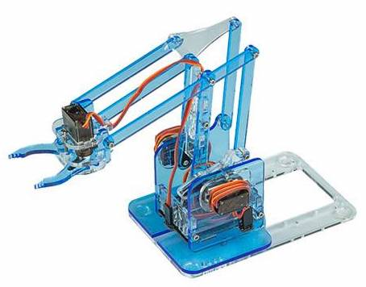

# asa3
Explorer robot with 4DOF arm, running MicroPython, created at AISVN.

Due to COVID-19 this session never started. This repository was created in December 2019 as preparation for the upcoming season. It's here for documentation purposes. Below a few steps of planning:

## Pictures from our T400 build at ASA session 3

Session 3 is from February 24th to May 29th. We have these 11 sessions:

1. February 25th
2. March 10th
3. March 17th
4. March 24th
5. April 7th
6. April 14th
7. April 21st
8. April 28th
9. May 5th
10. May 12th
11. May 26th

Some pictures of our progress:

## ESP8266 with Micropython

## Robot base

## Robot arm

