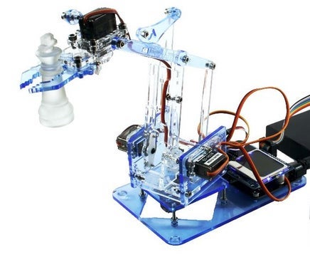

# Robot arm - MeArm v1.0

Since the flawed version v0.4 is still sold at [lazada.vn](https://www.lazada.vn/products/4-dof-acrylic-chua-lap-rap-diy-canh-tay-robot-diy-bo-cho-arduino-may-lam-ho-tro-hoc-tap-sg90-servo-i267650656-s391094259.html) and aliexpress.com we look forward to create the much improved v1.0

## Instructions

- [At learn.mearm.com](http://learn.mearm.com/docs/building-the-mearm-v1/)
- [Instructables v1.1](https://www.instructables.com/id/MeArm-V11-Tiny-Open-Source-Robot-Arm/)
- [As pdf from mearm](http://learn.mearm.com/assets/docs/building-the-mearm-v1/MeArm_v1.0_Manual_v1.4.pdf) v1.4 from 2015
- [PDF export of v1.1](http://learn.mearm.com/assets/docs/building-the-mearm-v1/MeArm-V1.1.pdf) from 2016

## Lasercut files

The files can be found at:

- [Thingiverse 993759](https://www.thingiverse.com/thing:993759)
- [Old v0.4](https://www.instructables.com/id/Pocket-Sized-Robot-Arm-meArm-V04/) from April 2014

## Additional materials

You will need some screws and nuts M3 as well. Specifically:

- Nut x 10
- 6mm x 9
- 8mm x 12
- 10mm x 3
- 12mm x 7
- 20mm x 4
