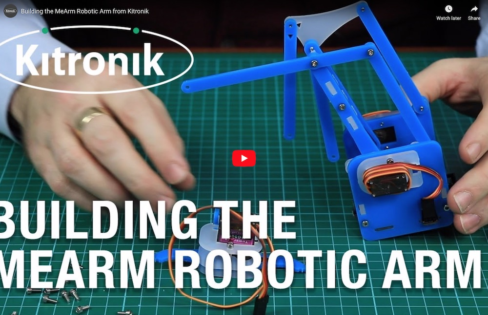

# Robot arm - MeArm v1.0

Since the flawed version v0.4 from April 2014 is still sold at [lazada.vn](https://www.lazada.vn/products/4-dof-acrylic-chua-lap-rap-diy-canh-tay-robot-diy-bo-cho-arduino-may-lam-ho-tro-hoc-tap-sg90-servo-i267650656-s391094259.html) and [aliexpress.com](https://www.aliexpress.com/item/33058691240.html) we look forward to create the much improved v1.0 from [MeArm](https://mearm.com) (or phenoptix alias Ben Gray from Nottingham) or [Mime Industries](https://mime.co.uk). It was published  September 2015. Thanks to a successful [Kickstarter campain](
https://www.kickstarter.com/projects/phenoptix/mearm-pocket-sized-industrial-robotics-for-everybo) from 2014.

## Instructions for assembly

- [At learn.mearm.com](http://learn.mearm.com/docs/building-the-mearm-v1/)
- [Instructables v1.1](https://www.instructables.com/id/MeArm-V11-Tiny-Open-Source-Robot-Arm/)
- [As pdf from mearm](http://learn.mearm.com/assets/docs/building-the-mearm-v1/MeArm_v1.0_Manual_v1.4.pdf) v1.4 from 2015
- [PDF export of v1.1](http://learn.mearm.com/assets/docs/building-the-mearm-v1/MeArm-V1.1.pdf) from 2016

## Lasercut files

The files can be found at:

- [Thingiverse 993759](https://www.thingiverse.com/thing:993759) from September 2015
- [Old v0.4](https://www.instructables.com/id/Pocket-Sized-Robot-Arm-meArm-V04/) from April 2014
- [Updated v1.1 on GitHub](https://github.com/mimeindustries/MeArm) from March 2017
- [Updated v3.0](https://www.thingiverse.com/thing:3420797/files) from February 2019 - needs M2.5 screws!

## Additional materials

### v1.0
You will need some screws and nuts M3 as well. Specifically:

- 10x - M3 Nut
- 6x  - M3 x 6mm
- 15x - M3 x 8mm
- 3x  - M3 x 10mm
- 8x  - M3 x 12mm
- 4x  - M3 x 20mm

### Old materials for v0.4
- M3 Nut x 10
- 6mm x 9
- 8mm x 12
- 10mm x 3
- 12mm x 7
- 20mm x 4

## MeArm v3.0

In [new version v3.0](https://learn.mime.co.uk/docs/building-the-mearm-v3/) from the renamed company [Mime industries](https://mime.co.uk).

To assemble you can follow [the instructions in the pdf](http://learn.mearm.com/assets/mearm.pdf) or watch the following video:

The lasercut files can be found on [thingiverse 3420797](https://www.thingiverse.com/thing:3420797/files). But it needs M2.5 screws. I guess it is:

- 10x - M3 Nut
- 6x  - M2.5 x 6mm
- 15x - M2.5 x 8mm
- 3x  - M2.5 x 10mm
- 8x  - M2.5 x 12mm
- 4x  - M2.5 x 20mm

And we need a pcb at the bottom.
